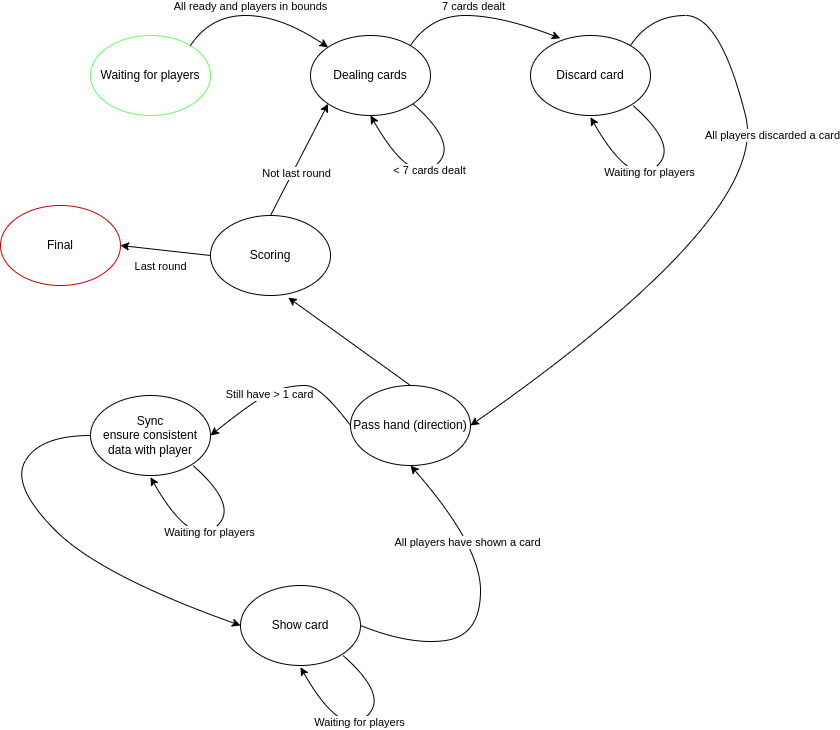

# Boomerang

This is a simple implementation of the boomerang Australia game. It is implemented using [`ratatui`](docs.rs/ratatui/)
and [`tokio`](tokio.rs/) among other libraries.

## Implementation

The app is heavily multi threaded and this is for good reason, the idea is to separate out all of the game logic from the
rest of the logic allowing for easy modifications in the future.
By using message passing in between threads instead of interfaces in sync code we further reduce the coupling between
structs at the cost of some complexity in error handling.

Furthermore the game rules are implemented as [states](src/australia/rules/states/) in a finite state machine,
allowing for interchangeable rule sets.
The rule set that is currently implemented can be represented like so


## Structure

f
All of the code that is specific to boomerang australia is located in [src](./src/), all other code ([server](server/),[tui](tui/)) is agnostic to the rules or even the intended application.
The [tui](tui/) crate defines interface related traits and an async runtime for a frontend.
The [server](server/) defines server and message passing things as well as a runtime for a async backend.

## Running

To run the code, first in one terminal, ensure that the server is running

```bash
cargo build --release && ./target/release/boomerang -m server
```

Then in at least two other terminals

```bash
cargo build --release && ./target/release/boomerang -m client
```
